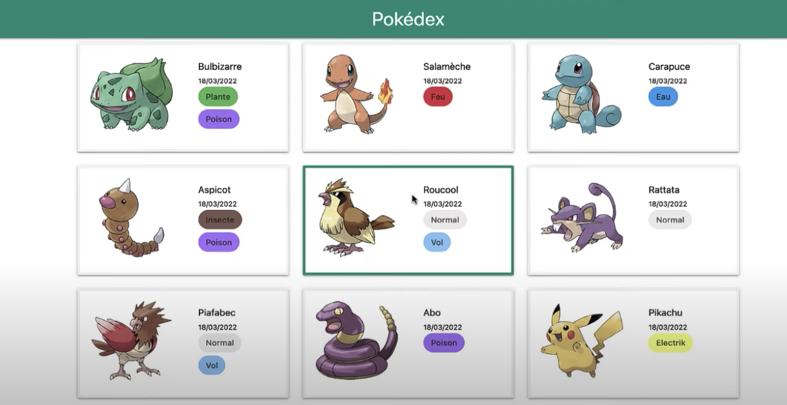

<br/>
<div align="center">
    
    <br/>
    <br/>
    <h1 align="center">POKEDEX</h1>
</div>
  <p align="center">
   Discovery of Angular
    <br />
    <br />
  </p>


<br/>
<br/>

<!-- TABLE OF CONTENTS -->
<details open="open">
  <summary>Table of Contents</summary>

  <ol>
    <li><a href="#illustrations">Illustration</a></li>
    <li><a href="#description">Description</a></li>
    <li><a href="#stack">Stack</a></li>
    <ul>
          <li><a href="#languages">Languages & Tools</a></li>
          <li><a href="#dependencies">Dependencies</a></li>
    </ul>
     <li><a href="#howto">How to use this project</a></li>
     <ul>
          <li><a href="#setup">Setup</a></li>
          <li><a href="#launch">Launch server</a></li>
          <li><a href="#display">Display in the browser</a></li>
    </ul>
    <li><a href="#goals">Goals</a></li>
    <li><a href="#status">Status</a></li>
    <li><a href="#contexte">Context</a></li>
  </ol>
</details>

<br>
<br>


## ✨ Illustrations <a id="illustrations"></a>


<br>
<br>

## 🗒 Description <a id="description"></a>
Demo project for building a pokedex and discover new framework : Angular ! 

<br>
<br>

## 🛠 Stack <a id="stack"></a>
### Languages & Tools <a id="languages"></a>
- Angular
- Javascript
- Typescript
- sass

### Dependencies <a id="dependencies"></a>
- angular-in-memory-web-api (server simulator)
- materialize
  
<br>
<br>

## ⚙️ How to use this project <a id="howto"></a>
### Setup <a id="setup"></a>
To install the dependencies of the project, just run npm install command :
```
npm install
```

### Launch server <a id="launch"></a>
```bash
ng serve
```

### Display in the browser  <a id="display"></a>
👉   http://localhost:4200

<br>
<br>

## 🎯 Goals <a id="goals"></a>
- Discover Angular
- Improve Typescript
- Play with Materialize

<br>
<br>

## 📈 Status <a id="status"></a>

Project not completed, work in progress ...

<br>
<br>

## 🗓 Context <a id="context"> </a>
Project developed as a junior web developer during my Licence Pro DLIS.

